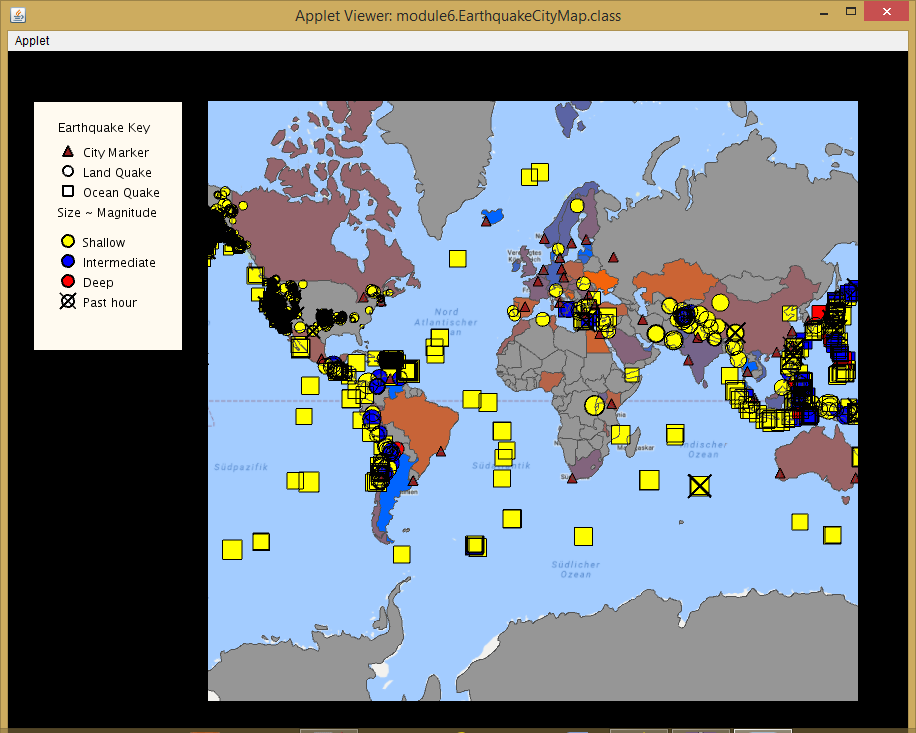
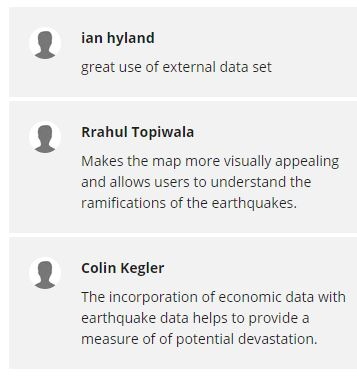

# Economic-Impact-Analysis-of-Earthquakes-on-Live-Maps

Helps analyze the economic impact of earthquakes by allowing one to visualize the amount of earthquakes and state of economy of a given place at the same time.
The countries are shaded according to the stock market data from the World Bank Site. The data is represented on the map as a gradient from red to blue. 
Red/Orange indicates low value (around 20) and ble indicates a high value (around 250). Data was unavailable for the countries in grey.

Used UnfoldingMaps and Processing library. Built as a part of Object Oriented Programming in Java course offered by UC San Diego through Coursera.
Dataset: https://datacatalog.worldbank.org/dataset/global-economic-monitor

**Please share your comments here**
https://www.coursera.org/learn/object-oriented-java/peer/XEvqA/programming-assignment-extension-peer-review/review/8NPH7XAiEeiPjArpa2oHpg

unfolding_app_template and UC San Diego/Coursera MOOC starter code
==================================================================

This is a skeleton to use Unfolding in Eclipse as well as some starter
code for the Object Oriented Programming in Java course offered by 
UC San Diego through Coursera.

A very basic Unfolding demo you'll find in the source folder in the default package. 
For more examples visit http://unfoldingmaps.org, or download the template with
examples.

The module folders contain the starter code for the programming assignments
associated with the MOOC.

Get excited and make things!

INSTALLATION

Import this folder in Eclipse ('File' -> 'Import' -> 'Existing Projects into
Workspace', Select this folder, 'Finish')

MANUAL INSTALLATION

If the import does not work follow the steps below.

- Create new Java project
- Copy+Paste all files into project
- Add all lib/*.jars to build path
- Set native library location for jogl.jar. Choose appropriate folder for your OS.
- Add data/ as src

TROUBLE SHOOTING

Switch Java Compiler to 1.6 if you get VM problems. (Processing should work with Java 1.6, and 1.7)

